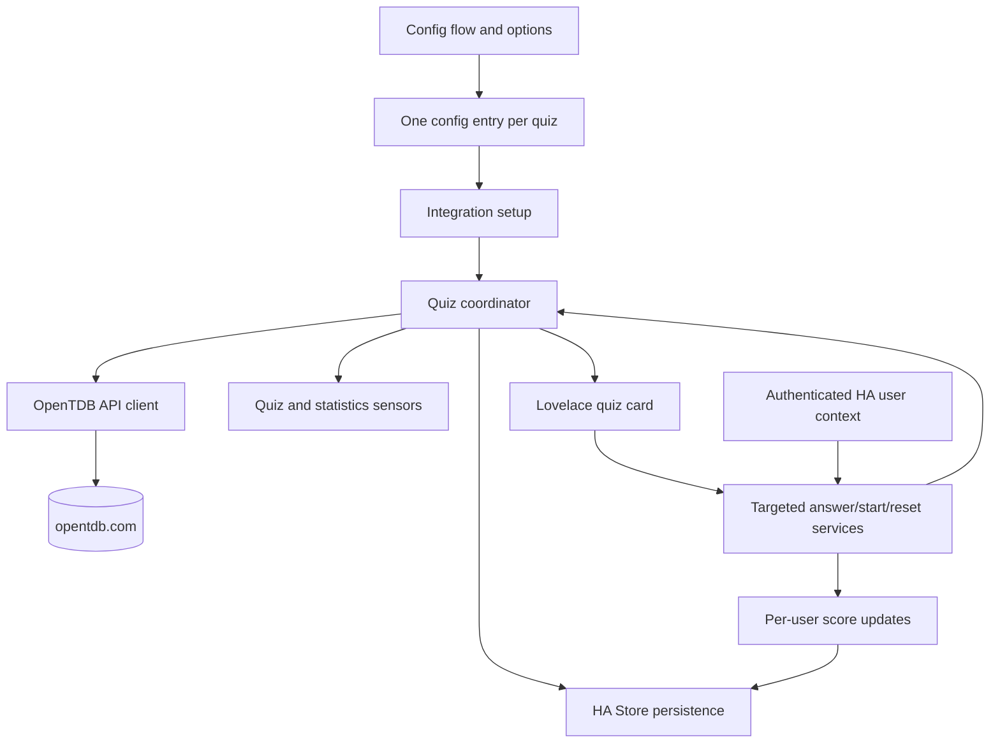

# OpenTDB Home Assistant Integration Plan

> Status: **EXPANDED HANDOVER PLAN - focused service dispatch fix and regression coverage.**
> Target: A HACS-installable Home Assistant custom integration and bundled Lovelace card backed by [Open Trivia DB](https://opentdb.com/).

## 1. Goals and Scope

Build a reusable trivia quiz experience in Home Assistant:

- Fetch configurable question sets from OpenTDB.
- Support multiple independent quizzes, with one config entry and device per quiz.
- Expose the active quiz, current question, answer state, score, completion time, and statistics through sensors and services.
- Present one question at a time in a full-width/full-height custom Lovelace card.
- Let the authenticated Home Assistant user answer once per question and immediately see whether the answer was correct.
- Start a new question set only through an explicit start/new-quiz action; refreshes and Home Assistant restarts must not silently replace an active quiz.
- Persist active sessions and user statistics across restarts.
- Refresh quiz data automatically once per day on a configurable schedule, while only creating a new question set when a quiz is started.
- Handle OpenTDB session tokens, response codes, retries, and rate limits conservatively.

### 1.1 Initial non-goals

- User accounts outside Home Assistant.
- Multiple attempts or answer changes after a question is submitted.
- A question review screen after completion.
- A separate HACS frontend repository or manual card resource installation.
- Alternate encodings as a user option. Use OpenTDB's default encoding.

## 2. Reference Architecture

Use `C:\git\hacs-wordnik` as the architectural baseline, adapting its config-flow, coordinator, sensor, service, persistence, bundled-card, and test patterns.



### 2.1 Proposed repository structure

```text
hacs-opentdb/
├── custom_components/
│   └── opentdb/
│       ├── __init__.py             # setup, coordinator wiring, and services
│       ├── api.py                  # async OpenTDB client and API error mapping
│       ├── config_flow.py          # setup and per-quiz options flow
│       ├── const.py                # domain, defaults, endpoint and storage constants
│       ├── coordinator.py           # quiz lifecycle, scheduling, persistence, scoring
│       ├── manifest.json
│       ├── sensor.py                # quiz state and statistics entities
│       ├── services.yaml            # service schemas and descriptions
│       ├── strings.json
│       ├── translations/
│       │   └── en.json
├── docs/
│   └── PLAN.md
├── scripts/
│   └── release.ps1               # version, commit, tag, push, and GitHub release workflow
├── tests/
│   ├── conftest.py
│   ├── test_api.py
│   ├── test_config_flow.py
│   ├── test_coordinator.py
│   ├── test_services.py
│   └── test_sensor.py
├── hacs.json
├── pyproject.toml
├── README.md
└── .github/workflows/
```

The Lovelace card is maintained in the separate `andrewbackway/hacs-opentdb-card` repository. This repository contains only the Home Assistant integration; its release script versions and publishes the integration without a frontend artifact.

## 3. OpenTDB API Integration

The implementation should mimic the URL generated by the OpenTDB API configuration page:

```text
https://opentdb.com/api.php?amount={amount}&category={category}&difficulty={difficulty}&type={type}
```

Only include optional query parameters when the user selected a value. Do not expose an encoding selector; omit `encode` and use OpenTDB's default response encoding.

### 3.1 Configuration fields

Each quiz config entry should support:

| Field | Default | Notes |
| --- | ---: | --- |
| Quiz name | Required | Used for the device and entity naming. |
| Number of questions | `10` | Validate against OpenTDB's supported range, normally 1-50. |
| Category | Any category | Populate from OpenTDB's category endpoint where practical; retain an all-categories option. |
| Difficulty | Any difficulty | `easy`, `medium`, `hard`, or all. |
| Question type | Any type | `Multiple Choice`, `True / False`, or `Any Type`, matching the OpenTDB API configuration page. Omit `type` for Any Type, send `multiple` for Multiple Choice, and send `boolean` for True / False. |
| Daily refresh time | `00:00` | Local Home Assistant time. |

The setup flow should validate the selected combination by requesting a question set or an appropriate lightweight API call. It should reject invalid combinations and surface OpenTDB response codes clearly.

### 3.2 API client responsibilities

`OpenTdbApiClient` should be a thin async wrapper using Home Assistant's shared HTTP session. It should:

- Build URLs with structured query parameters and URL encoding.
- Fetch categories and question sets.
- Decode HTML entities in questions and answers before exposing them to sensors/card code, while preserving the original API values only if needed for diagnostics.
- Parse `response_code` and map failures to integration-specific exceptions.
- Handle network failures, HTTP errors, malformed payloads, exhausted question sets, and rate limiting.
- Use an OpenTDB session token for each quiz where appropriate:
  - request a token during setup or before the first set;
  - send it with subsequent question requests;
  - reset it when OpenTDB reports an exhausted token/question pool;
  - recreate it when the API reports an invalid token.
- Avoid logging API URLs containing future secrets or excessive question content.
- Respect OpenTDB's documented request limitations and avoid retry storms. Daily fetches and explicit user actions should be serialized per quiz.

The plan should be verified against the current OpenTDB response-code and token behavior during implementation, because those API details control recovery logic.

## 4. Quiz Lifecycle and Coordinator

Create one `OpenTdbDataUpdateCoordinator` per config entry/device. The coordinator is the source of truth for the quiz session and all entities.

### 4.1 Session state

Persist enough state to resume a quiz after restart, including:

- Quiz/config entry identity and question-set identifier/version.
- Ordered questions, shuffled answer choices, and the correct answer representation.
- Current question index.
- Per-question answer result and submission timestamp.
- Session start and completion timestamps.
- Current score and completion percentage.
- Active/completed/not-started status.
- Last successful fetch and error metadata where useful.

Correct answers must never be exposed in ordinary sensor attributes while the question is unanswered. The frontend should receive only the choices and a server-controlled result after the answer service is processed.

### 4.2 State transitions

1. **Idle:** no active set, or the previous set is complete. Show a start/new-quiz action.
2. **Active:** expose exactly one unanswered question at a time.
3. **Answered:** lock the question, record the authenticated HA user's answer, and expose correct/incorrect feedback. A question can only be submitted once.
4. **Next:** advance only through an explicit next action, or define the card's answer interaction to advance after feedback while preserving the one-attempt rule.
5. **Complete:** expose final percentage and elapsed time only; do not add a review page.

A single question set is shared by the quiz device, while each authenticated user has independent progress/results for that set if the product requires users to play independently. This is the key model decision to resolve in implementation: determine whether a device has one shared current index or a per-user current index. The preferred design is **per-user session progress** so one user's answer cannot move another user's card forward, with the fetched question set shared across users.

### 4.3 Daily scheduling

Use Home Assistant's time tracking pattern from Wordnik:

- Schedule a daily coordinator refresh at the configured local time.
- The scheduled refresh checks whether a new set is needed, but does not automatically fetch/replace an active or completed quiz.
- A new question set is fetched only when the user invokes `opentdb.start_quiz` or `opentdb.new_quiz`, according to the selected action semantics.
- If a set is started after the daily boundary, it becomes the current daily set for that quiz.
- Preserve the last good state during transient API failures and expose coordinator availability/error state.

## 5. User Identity and Statistics

Answer and reset services must use the authenticated Home Assistant service-call context (`context.user_id`) as the player identity. Calls without a user context should be rejected for score-changing operations rather than attributing results to an ambiguous shared user.

Persist statistics in HA's `Store`, scoped by config entry and stable HA user ID. Store lifetime totals and enough history to calculate daily/weekly aggregates without losing prior results:

- Questions answered.
- Correct answers.
- Incorrect answers.
- Percentage score.
- Quizzes started and completed.
- Total elapsed quiz time and average completion time.
- Current and best streak where meaningful.
- Per-quiz and all-time totals.
- Daily/weekly aggregates.
- Last played/completed timestamps.

Privacy and lifecycle requirements:

- Do not expose raw user IDs in entity names or the card.
- Remove or reconcile stats when HA users are deleted where the available HA API permits it.
- Keep the persistence schema versioned so future changes can migrate data.
- Ensure duplicate service calls cannot award points twice, including after a restart.

### 5.1 Sensor strategy

The sensor model should describe the quiz as a stateful activity, not treat the question text as the primary sensor state. Every quiz device exposes a small, stable set of sensors. The coordinator builds a user-specific view using the authenticated user associated with the latest service interaction and updates all related entities together.

| Entity | State | Attributes and purpose |
| --- | --- | --- |
| Quiz | `idle`, `active`, `feedback`, or `complete` | Canonical quiz state, quiz name, question number/total, set ID, active user progress, available actions, and last error. This is the card's primary entity. |
| Question | `1`-based question number or `unknown` | One current question text, shuffled answer choices, category, difficulty, OpenTDB type, and question ID. Do not expose the correct answer before submission. |
| Score | Current user's correct-answer count | Answered count, incorrect count, percentage, current question result, and whether the question is locked. |
| Elapsed time | Seconds | Start time, completion time, running/completed status, and display-ready duration. |
| Player statistics | Lifetime percentage for the current user | Lifetime questions/correct/incorrect, quizzes started/completed, total and average time, current/best streak, daily and weekly totals, and last played timestamp. |
| Quiz statistics | Aggregate percentage for the quiz | Aggregate questions/correct/incorrect and quiz completion totals. Do not expose raw HA user IDs. |

The quiz sensor is the card binding point; the card discovers the companion question, score, elapsed-time, player-statistics, and quiz-statistics entities from the device registry and unique IDs. This avoids requiring users to select a fragile question entity while still making every value available to automations. Long question text, choices, and statistic objects belong in attributes so entity states remain within Home Assistant's state limits.

User isolation is explicit: each logged-in HA user has an independent cursor and answer history over the shared fetched question set. A sensor update for one user must not overwrite another user's persisted progress. Dashboard interactions are expected to run in a logged-in HA session so the integration can identify the player from the service context.

## 6. Services

Register domain services once, with device/entity targeting matching the Wordnik service pattern:

| Service | Purpose | Required context |
| --- | --- | --- |
| `opentdb.start_quiz` | Fetch/start a new question set for the targeted quiz | Authenticated HA user |
| `opentdb.new_quiz` | Explicitly discard the current set and fetch a fresh set | Authenticated HA user; confirm overwrite rules |
| `opentdb.submit_answer` | Submit one answer for the current question | Authenticated HA user, question index, selected answer |
| `opentdb.next_question` | Reserved backend action; normally the card advances automatically after a short feedback state | Authenticated HA user |
| `opentdb.reset_quiz` | Reset the user's current progress without awarding completion | Authenticated HA user |
| `opentdb.refresh` | Retry/reconcile current data without replacing the set | Optional authenticated context |
| `opentdb.refresh_questions` | Fetch a new question set and replace the current set | Authenticated HA user |

The card should call these services with a targeted OpenTDB sensor entity. Home Assistant resolves that entity target to the owning config entry before the integration selects coordinators. The coordinator must validate that the target belongs to the caller's intended quiz, that the question index matches, and that the question has not already been answered. After `submit_answer` succeeds, the card shows correct/incorrect feedback briefly and then invokes the next transition automatically. `new_quiz` replaces the current set immediately, including an unfinished set; no `force` confirmation is required.

Service schemas and translations should document that answers are one-shot and that `new_quiz` can discard unfinished progress. Consider requiring an explicit `force` field for destructive replacement of an active quiz.

## 7. Config Flow and Multiple Quizzes

Follow the Wordnik config-flow pattern, but each selection creates one independent config entry/device rather than one entry per difficulty tier.

Setup flow:

1. Enter a quiz name and OpenTDB request options.
2. Fetch/validate categories and the requested question-set combination.
3. Configure the daily refresh time.
4. Create a unique config entry and device.
5. Prevent duplicate quiz names or provide a stable unique ID while allowing different quizzes with different settings.

Options flow should reset the targeted quiz when question-set parameters or the refresh time are saved. The reset must be explicit in the options-flow result and must not award completion credit; the next user action starts a set using the new options.

Each device should be independently targetable from a dashboard, and one Home Assistant instance should support multiple quizzes such as general trivia, science, and true/false.

## 8. Lovelace Card

Maintain the card in `andrewbackway/hacs-opentdb-card` as a separate HACS Dashboard repository. The card should target the quiz entity and use the integration's services for the interactive workflow.

### 8.1 Configuration

Support:

- Quiz device or service/entity target.
- Optional title.
- Optional display of category, difficulty, and question count.
- Start/restart controls.
- Whether to require a confirmation before replacing an active set.

The card must not require users to manually configure a separate resource after installing the HACS integration.

### 8.2 Interaction and layout

- Use the full available card width and height within responsive limits.
- Show one question only.
- Render answer choices as large, accessible controls with stable dimensions.
- On click, call `opentdb.submit_answer`; disable all choices immediately while the request is pending.
- Show a clear correct/incorrect result using an icon plus text, without revealing the answer before submission.
- Permit exactly one attempt per question.
- Show correct/incorrect feedback with a clear icon and automatically advance after a short, accessible feedback state.
- At completion show only total time taken and percentage score, plus a start-new-quiz action. Do not show a question review.
- Show the current user's score and relevant lifetime statistics without exposing another user's private details.
- Handle loading, unavailable, idle, active, answered, complete, token recovery, and API error states.
- Use Home Assistant theme variables, semantic elements, keyboard focus, `aria-label`s, and sufficient contrast.
- Use familiar icons for answer feedback, start, next, reset, and statistics controls. Tooltips should identify unfamiliar icon-only controls.
- Keep text and controls contained on narrow mobile cards and wide desktop layouts.

The card should listen for entity updates rather than maintaining an independent copy of quiz truth. Optimistic feedback may be used for responsiveness, but the coordinator response is authoritative.

## 9. HACS Packaging and Quality Gates

`manifest.json` should declare the OpenTDB domain, config flow, cloud-polling IoT class, documentation, issue tracker, code owners, and the minimum supported Home Assistant version chosen before implementation. `hacs.json` should identify the repository as an integration. Add CI for:

- Home Assistant `hassfest`.
- HACS validation.
- Ruff and the repository's configured Python checks.
- Pytest with `pytest-homeassistant-custom-component`.
- Card build and, if practical, frontend type/lint checks.

Update `README.md` with installation, OpenTDB attribution/license information, configuration, service examples, card setup, user-stat persistence, and known API limitations. OpenTDB content is attributed under the project's Creative Commons Attribution-ShareAlike 4.0 International License; verify the current attribution wording before release.

## 10. Test Plan

### API tests

- URL construction for every combination of amount/category/difficulty/type.
- Default encoding behavior.
- HTML entity decoding.
- Successful question and category parsing.
- OpenTDB response codes for success, invalid parameters, token errors, empty results, and rate limits.
- Network/HTTP failures and retry behavior.
- Token create, reuse, reset, and replacement.

### Config-flow tests

- Valid setup and unique device/entry creation.
- Invalid request combinations and API failures.
- Category loading/fallback behavior.
- Multiple independent quiz entries.
- Options updates and deferred application to active sessions.

### Coordinator and persistence tests

- Start a set only through the explicit action.
- Daily scheduler does not replace an active or completed set.
- Restart restores an active session and prevents duplicate scoring.
- One-attempt enforcement, stale question-index rejection, and correct/incorrect outcomes.
- Per-user progress isolation.
- Completion percentage and elapsed-time calculation.
- Lifetime, daily, weekly, and aggregate stats persistence/migration.
- API failure retains the last good state.

### Service, sensor, and card tests

- Sensor targeting routes to the correct coordinator and does not invoke other quiz entries.
- Missing user context is rejected for scoring services.
- Sensor states/attributes contain all requested current and statistics data without leaking unanswered correct answers.
- Card renders idle, loading, active, feedback, completion, and error states.
- Card answer controls lock after submission and call the correct service.
- Responsive rendering, keyboard access, and icon feedback are manually verified.

### 10.1 Confirmed service-dispatch regression

The current integration has a confirmed async bug in `custom_components/opentdb/__init__.py`:
`get_coordinators` calls `async_extract_config_entry_ids(hass, call)` without awaiting it, then
iterates over the resulting coroutine. Service calls therefore fail with
`'coroutine' object is not iterable` before a targeted coordinator method can run.

#### Implementation steps

1. Change the assignment inside `get_coordinators` to await the helper:

   ```python
   ids = await async_extract_config_entry_ids(hass, call)
   ```

2. Keep the change limited to the service dispatch path. Do not alter service names, target
   schemas, coordinator APIs, or the fixed sensor description keys.
3. Confirm all callers continue to await `get_coordinators`; the existing service handlers
   already do this and require no structural change.
4. Do not suppress the coroutine warning or convert the helper result synchronously. The
   helper is asynchronous and must be awaited in the existing async handler.

#### Service test setup

Add `tests/test_services.py` using the Home Assistant custom-component test fixtures. The test
module should:

- Create one or more `ConfigEntry` instances with distinct entry IDs and valid OpenTDB settings.
- Place test coordinators in `hass.data[DOMAIN]` and register the integration services through
  `async_setup`.
- Use `AsyncMock` coordinator methods so tests verify dispatch without network calls or storage
  side effects.
- Build service calls with a valid OpenTDB sensor entity target and an authenticated
  `Context(user_id=...)`.
- Assert the selected coordinator method is awaited and that the service call completes without
  a coroutine-iteration exception.

#### Required service matrix

| Service | User context | Coordinator method | Minimum assertion |
| --- | --- | --- | --- |
| `start_quiz` | Required | `async_start_quiz(user_id)` | Targeted coordinator starts the quiz. |
| `new_quiz` | Required | `async_start_quiz(user_id)` | Alias dispatches to the same start behavior. |
| `submit_answer` | Required | `async_answer_question(user_id, question_index, answer)` | Index and answer are forwarded unchanged. |
| `next_question` | Required | `async_next_question(user_id)` | Only the targeted quiz advances. |
| `reset_quiz` | Required | `async_reset_quiz(user_id)` | Only the targeted user's reset path is invoked. |
| `refresh` | Optional | `async_refresh()` | Refresh completes and does not require a user. |

Add a separate unauthenticated-call assertion for each user-dependent service, or parameterize
the test, to preserve the existing `ValueError` contract. The refresh test should prove that its
optional user context remains optional.

#### Target routing test

Set up two OpenTDB quiz entries with different entry IDs and corresponding sensor entities.
Invoke a service against the first quiz sensor and assert that only the first coordinator's
method is awaited. Repeat with the second sensor if the fixture makes this inexpensive. This is
the discriminating test for the bug: it exercises the awaited
`async_extract_config_entry_ids` result rather than calling a coordinator directly.

#### Entity identity regression

Add or extend sensor/entity-registry coverage for two entries that have the same display quiz
name. Home Assistant must assign unique entity IDs because the integration's stable unique IDs
are based on the config-entry ID and the fixed sensor description key. Assert that:

- No entity IDs collide between the entries.
- Each entry creates the same six suffixes: `quiz`, `question`, `score`, `elapsed_time`,
  `player_statistics`, and `quiz_statistics`.
- The duplicate display name does not change those suffixes or the service target resolution.

This test is intentionally separate from config-flow duplicate-name handling. The config flow
currently rejects duplicate normalized names; the entity test protects the lower-level identity
contract if entries with repeated display names are restored, imported, or created by a fixture.

#### Acceptance criteria

- `opentdb.start_quiz` succeeds for a valid OpenTDB sensor target and authenticated user.
- `opentdb.new_quiz`, `submit_answer`, `next_question`, `reset_quiz`, and `refresh` complete
  without `'coroutine' object is not iterable`.
- `opentdb.refresh_questions` fetches a new question set for the authenticated user.
- A targeted service call affects only the coordinator/device associated with the selected
  OpenTDB sensor.
- User-dependent services reject calls without `context.user_id`; `refresh` does not.
- Repeated quiz display names produce unique entity IDs while retaining all fixed sensor suffixes.
- Focused service and entity tests pass, followed by the complete Python test suite and Ruff.

#### Validation commands

Run from the repository root after the edit:

```powershell
python -m pytest tests/test_services.py
python -m pytest tests/test_services.py tests/test_sensor.py
python -m pytest
ruff check .
```

## 11. Implementation Milestones

- **M0 - Approval and decisions:** confirm this plan and minimum HA version.
- **M1 - API foundation:** manifest, constants, async client, categories/questions, response-code/token/rate-limit handling, and API tests.
- **M2 - Quiz backend:** config flow, coordinator, persisted session state, daily scheduler, services, core sensors, and the awaited service-target regression fix.
- **M3 - User scoring:** HA context validation, per-user progress, one-attempt enforcement, lifetime/history stats, migration, and tests.
- **M4 - Lovelace card:** bundled card, auto-registration, visual editor, answer interactions, completion view, responsive/accessibility behavior.
- **M5 - Release hardening:** README, translations, CI, hassfest/HACS checks, manual HA test matrix, branding if desired, and first tagged release.

## 12. Decisions and Remaining Questions

### Confirmed decisions

1. Each quiz is a separate config entry and Home Assistant device.
2. Quiz configuration includes name, number of questions, category, difficulty, question type, and daily refresh time.
3. The daily schedule does not automatically fetch a replacement set; a user explicitly starts a new set.
4. Each question allows one attempt only.
5. Scores and stats are attributed to the authenticated Home Assistant user.
6. Persist both aggregate history and lifetime statistics.
7. Expose all current quiz and statistics data through sensors/attributes.
8. The card can target a quiz device or service/entity.
9. The completion view shows total time taken and percentage only.
10. Include OpenTDB session-token and rate-limit handling.
11. Encoding is not configurable; use the API default.

### Confirmed implementation choices

1. **Progress model:** users share the fetched question set, but each logged-in HA user has an independent cursor, answer history, score, and completion time.
2. **Advancement:** after answer feedback, the card advances automatically after a short feedback state.
3. **Replacing active sets:** `new_quiz` replaces the current set immediately, including an unfinished quiz.
4. **Changed options:** saving options resets the quiz; the next start uses the new request parameters.
5. **Minimum Home Assistant version:** use the Wordnik project's supported baseline unless implementation validation shows it is incompatible with the OpenTDB design; record the exact version in manifest and CI.
6. **Stats retention:** retain daily and weekly history forever, alongside lifetime totals.

## 13. Execution Order for This Handover

This handover is intentionally narrower than the full product roadmap above. Execute it in this
order:

1. Apply the one-line await fix in `custom_components/opentdb/__init__.py`.
2. Add the focused service regression and target-routing tests.
3. Add or extend sensor/entity-registry coverage for repeated quiz names and stable suffixes.
4. Run the focused tests immediately; repair only failures in this service/entity slice.
5. Run the complete test suite and Ruff, then review the diff for unrelated changes.
6. Update the card repository separately only if its current target selector or service payload
  differs from the canonical contract documented here.

The existing broader milestones remain the long-term roadmap. They should not block this focused
fix, and this handover does not require a release, version bump, commit, or tag.
